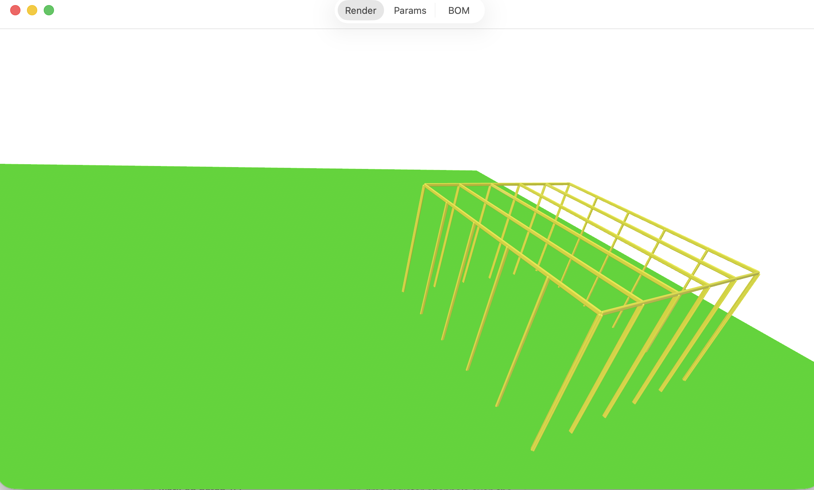
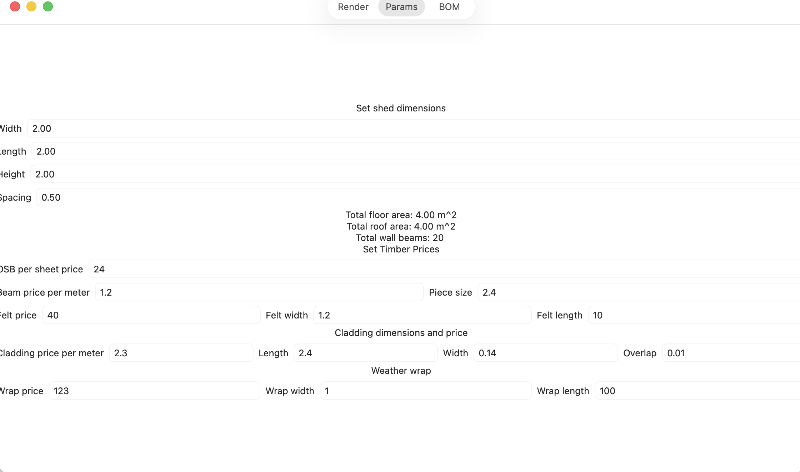
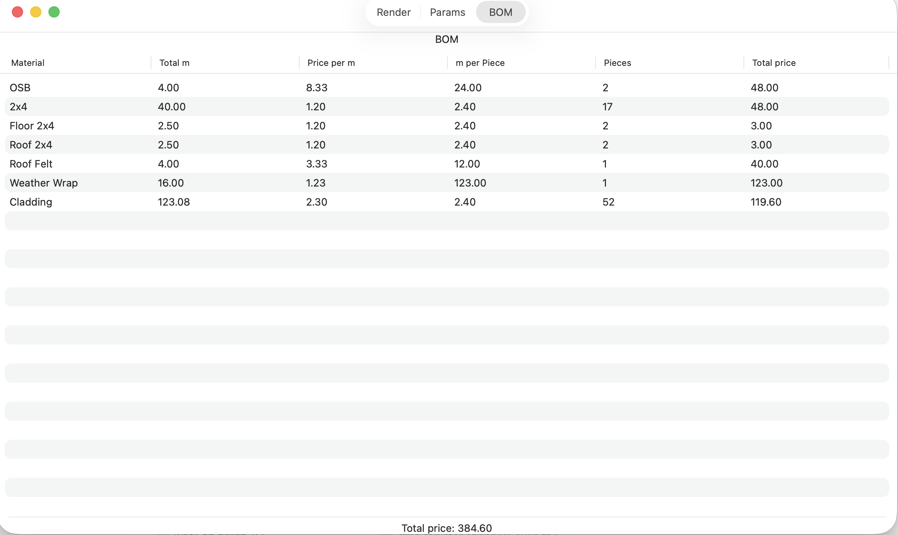

# ShedCalc - simple shed material calculator

Project repo: https://git.main.lv/cgit.cgi/ShedCalc.git/

Calculates amount of material is needed to build the shed.
Calculates:
 * structure timber
 * roof felt
 * weather wrap
 * sheets for roof and floor
 * give total price

Todo:
 * for roof add support for overhang
 * add wall render
 * add pitched roof's

Release v0.1

